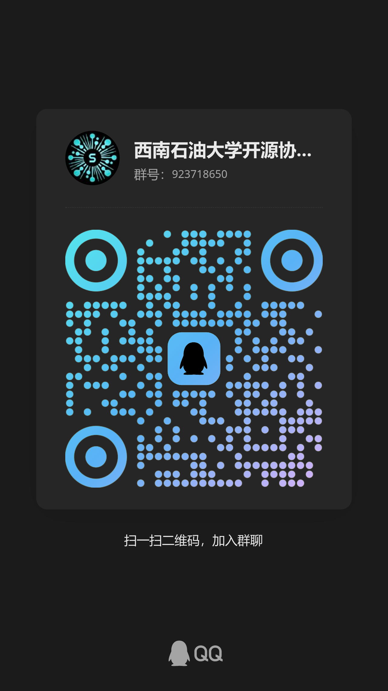

<!-- markdownlint-disable MD041 -->
<div align="center">
  <h1>MateChat React</h1>
</div>

<div align="center">

MateChat React is a front-end AI scenario solution UI library based on Huawei DevUI Design, the React version of [MateChat](https://github.com/DevCloudFE/MateChat), .

[](https://www.npmjs.com/package/@matechat/react)
[](https://www.npmjs.com/package/@matechat/react)
[](./LICENSE)

</div>

<div align="center">

English | [简体中文](./README.zh-CN.md)

</div>

---

## Introduction

**MateChat React** is a React component library designed for AI-driven interfaces, such as chat assistants, prompt tools, agent frameworks, and more. It is the React version of [MateChat](https://github.com/DevCloudFE/MateChat), offering consistent features and styles.

MateChat is based on [Huawei DevUI Design](https://devui.design/), offering a modern visual language, consistent user experience, and excellent scalability.

For more information, visit the MateChat React website: [MateChat React](http://matechat.noctisynth.org/)

## Features

- **Comprehensive Components**: Provides a wide range of components tailored for AI scenarios, including chat bubbles, input areas, and conversation lists.
- **Customizable Styles**: Built with Tailwind CSS, allowing easy customization to fit your design needs.
- **Highly Customizable**: All components are highly customizable, allowing you to easily adapt them to your specific needs.
- **Headless Components**: All components are able to use in headless mode through [shadcn/ui](https://ui.shadcn.com/).

## Installation

### Classical Installation

```bash
# npm
npm install @matechat/react

# or pnpm
pnpm add @matechat/react
```

### Installation with shadcn/ui

1. Initialize shadcn/ui

   ```bash
   pnpm dlx shadcn@latest init
   ```

2. Install MateChat React components

   It is possible to install MateChat React components with shadcn/ui CLI. For example, to install the bubble component of MateChat React:

   ```bash
   pnpm dlx shadcn@latest add https://matechat.noctisynth.org/r/bubble.json
   ```

## Documentation

The documentation is still in progress, but you can feel free to create a new issue in [GitCode](https://gitcode.com/DevCloudFE/MateChat/issues) or [GitHub](https://github.com/DevCloudFE/MateChat/issues) to submit your questions or suggestions. This project is still under development, so the documentation is not complete yet, some features may change in the future.

For more information, please track the progress in [#5](https://github.com/DevCloudFE/matechat-react/issues/5).

## Star History

[](https://www.star-history.com/#DevCloudFE/matechat-react&Date)

---

## Contribution

We welcome all kinds of contributions:

- File issues for bugs or features
- Create pull requests
- Help with documentation or translations

**Contributors:**

<a href="https://github.com/DevCloudFE/matechat-react/graphs/contributors">
  
</a>

## Contact Us

|                                              MateChat React Chat Group                                               |                                         SOA Chat Group                                         |
| :------------------------------------------------------------------------------------------------------------------: | :--------------------------------------------------------------------------------------------: |
| [](https://qm.qq.com/q/aMLehEXzBm) | [](https://qm.qq.com/q/lOocKriX74) |

## License

This project is licensed under the [MIT License](./LICENSE).
