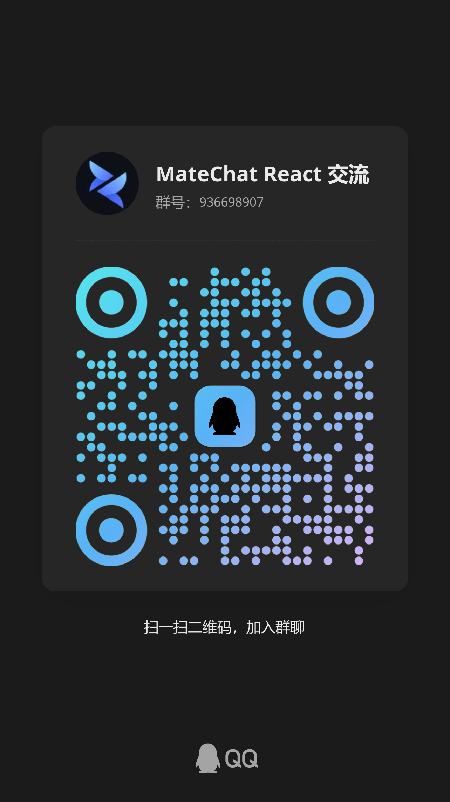
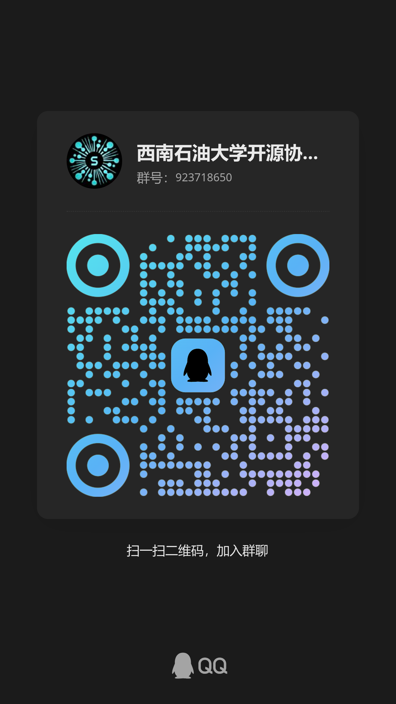

<!-- markdownlint-disable MD041 -->
<div align="center">
  <h1>MateChat React</h1>
</div>

<div align="center">

MateChat React 是 [MateChat](https://github.com/DevCloudFE/MateChat) 的 React 版本，
它是一个基于华为 DevUI 设计的前端 AI 场景解决方案 UI 库。

[](https://www.npmjs.com/package/@matechat/react)
[](https://www.npmjs.com/package/@matechat/react)
[](./LICENSE)

</div>

<div align="center">

[English](./README.md) | 简体中文

</div>

---

## 介绍

**MateChat React** 是一个专为 AI 驱动界面打造的 React 组件库，适用于聊天助手、提示工程工具、Agent 框架等场景。这是 [MateChat](https://github.com/DevCloudFE/MateChat) 的 React 版本，提供一致的功能与风格。

MateChat 基于 [华为 DevUI Design](https://devui.design/)，提供现代视觉语言、一致的用户体验以及良好的可扩展性。

了解更多请访问 MateChat React 网站： [MateChat React](http://matechat.noctisynth.org/)

## 特性

- **全面的组件**: 提供一系列专为 AI 场景定制的组件，包括聊天气泡、输入区域和会话列表等。
- **可定制的样式**: 基于 Tailwind CSS 构建，可轻松定制以满足您的设计需求。
- **高度可定制**: 所有组件都具有高度可定制性，让您轻松适应特定需求。
- **无头组件**: 所有组件都可以通过 [shadcn/ui](https://ui.shadcn.com/) 以无头模式使用。

## 安装

### 传统安装

```bash
# npm
npm install @matechat/react

# or pnpm
pnpm add @matechat/react
```

### 使用 shadcn/ui 安装

1. 初始化 shadcn/ui

   ```bash
   pnpm dlx shadcn@latest init
   ```

2. 安装 MateChat React 组件

   您可以使用 shadcn/ui CLI 安装 MateChat React 组件。例如，安装 MateChat React 的气泡组件：

   ```bash
   pnpm dlx shadcn@latest add https://matechat.noctisynth.org/r/bubble.json
   ```

## 文档

文档仍在完善中，如果有任何疑问或建议，欢迎在 [GitCode](https://gitcode.com/DevCloudFE/MateChat/issues) 或 [GitHub](https://github.com/DevCloudFE/MateChat/issues) 提 issue。
由于项目仍在开发中，部分功能和文档可能会有调整。

可关注进展：[#5](https://github.com/DevCloudFE/matechat-react/issues/5)。

## Star 趋势

[](https://www.star-history.com/#DevCloudFE/matechat-react&Date)

---

## 如何贡献

我们欢迎各种形式的贡献：

- 提交 bug 或需求 issue
- 创建 pull request
- 帮助完善文档或翻译

**贡献者：**

<a href="https://github.com/DevCloudFE/matechat-react/graphs/contributors">
  
</a>

---

## 联系我们

|                                              MateChat React 技术交流群                                               |                                         SOA 技术交流群                                         |
| :------------------------------------------------------------------------------------------------------------------: | :--------------------------------------------------------------------------------------------: |
| [](https://qm.qq.com/q/aMLehEXzBm) | [](https://qm.qq.com/q/lOocKriX74) |

---

## License

该项目已获得 [MIT 许可](./LICENSE).
